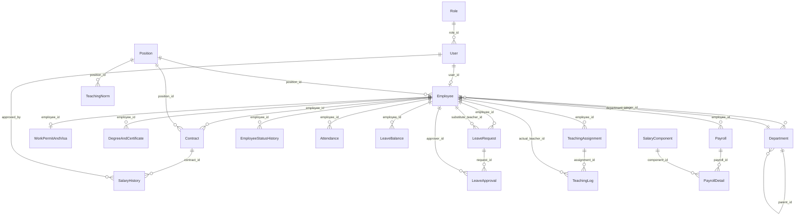

# school-hrm

quy tắc nghiệp vụ của employee lifecycle transitions:

| From      | To        | Cho phép? | Lý do                  |
| --------- | --------- | --------- | ---------------------- |
| PROBATION | WORKING   | Có        | Đạt thử việc           |
| PROBATION | RESIGNED  | Có        | Nghỉ trong thử việc    |
| WORKING   | SUSPENDED | Có        | Tạm đình chỉ           |
| SUSPENDED | WORKING   | Có        | Trở lại làm việc       |
| WORKING   | RESIGNED  | Có        | Nghỉ việc              |
| WORKING   | RETIRED   | Có        | Nghỉ hưu               |
| RESIGNED  | WORKING   | Không*    | Không tự kích hoạt lại |
| RETIRED   | WORKING   | Không*    | Không tự kích hoạt lại |
| RESIGNED  | RETIRED   | Không     | Không hợp lệ           |
| RETIRED   | RESIGNED  | Không     | Không hợp lệ           |

ảnh hưởng của employee status 

## Cấu Trúc & Mối Liên Hệ Giữa Các Bảng Trong Cơ Sở Dữ Liệu (Database Schema & Relationships)

Hệ thống quản lý nhân sự trường học (`school-hrm`) được tổ chức thành **6 phân hệ (module) nghiệp vụ chính** với cấu trúc kế thừa và liên kết khóa ngoại (Foreign Key) chặt chẽ. Mọi thực thể nghiệp vụ đều kế thừa từ `BaseEntity` (cung cấp: `id` PK bigint, `created_at`, `updated_at`, `created_by`, `updated_by`).

---

### 1. Sơ Đồ Thực Thể Liên Kết Tổng Thể (ERD - Entity Relationship Diagram)

---

### 2. Chi Tiết Mối Liên Hệ Theo Từng Phân Hệ

#### 2.1. Phân Hệ Người Dùng & Cơ Cấu Tổ Chức (Core / Organization)
* **`Role` (Bảng `role`)**:
  * Lưu trữ vai trò hệ thống (`ADMIN`, `HR_MANAGER`, `TEACHER`,...).
  * **1 - N với `User`**: Một vai trò được cấp cho nhiều tài khoản (`User.role_id -> Role.id`).
* **`User` (Bảng `users`)**:
  * Quản lý tài khoản đăng nhập, chứng thực mật khẩu và trạng thái tài khoản.
  * **1 - 1 với `Employee`**: Một tài khoản liên kết với tối đa một hồ sơ nhân viên (`Employee.user_id -> User.id`, Unique).
  * **1 - N với `SalaryHistory`**: Một user (người phê duyệt) có thể duyệt nhiều quyết định điều chỉnh lương (`SalaryHistory.approved_by -> User.id`).
* **`Department` (Bảng `department`)**:
  * Quản lý phòng ban / khoa bộ môn.
  * **Tự liên kết N - 1 (Cây phòng ban)**: Một phòng ban con trỏ đến phòng ban cha qua `parent_id` (`Department.parent_id -> Department.id`).
  * **N - 1 với `Employee` (Trưởng phòng)**: Một nhân viên có thể làm người quản lý/trưởng bộ môn của phòng ban (`Department.manager_id -> Employee.id`).
* **`Position` (Bảng `position`)**:
  * Master data về chức vụ / vị trí công tác (Giáo viên bộ môn, Trưởng bộ môn, Hiệu trưởng, Nhân viên...).
  * **1 - N với `Employee`**: Một vị trí gán cho nhiều nhân viên (`Employee.position_id -> Position.id`).
  * **1 - N với `Contract`**: Định danh vị trí công việc khi ký kết trên từng hợp đồng (`Contract.position_id -> Position.id`).
  * **1 - N với `TeachingNorm`**: Quy định định mức giờ dạy chuẩn theo từng vị trí (`TeachingNorm.position_id -> Position.id`).

---

#### 2.2. Phân Hệ Hồ Sơ Nhân Viên & Hợp Đồng (Employee Profile & Contract)
* **`Employee` (Bảng `employee`)**:
  * Là bảng trung tâm của toàn bộ hệ thống HRM, liên kết với hầu hết các phân hệ khác.
  * **N - 1 với `Department`**: Nhân viên trực thuộc một phòng ban (`Employee.department_id -> Department.id`).
  * **N - 1 với `Position`**: Nhân viên giữ một chức vụ hiện tại (`Employee.position_id -> Position.id`).
  * **1 - 1 với `User`**: Liên kết tài khoản đăng nhập (`Employee.user_id -> User.id`).
  * **1 - 1 với `WorkPermitAndVisa`**: Quản lý giấy phép lao động / thị thực / TRC đối với giáo viên và nhân sự quốc tế (`WorkPermitAndVisa.employee_id -> Employee.id`, Unique).
  * **1 - N với `DegreeAndCertificate`**: Một nhân viên sở hữu nhiều văn bằng, chứng chỉ sư phạm hoặc chuyên môn (`DegreeAndCertificate.employee_id -> Employee.id`).
  * **1 - N với `Contract`**: Một nhân viên trải qua nhiều giai đoạn hợp đồng (thử việc, xác định thời hạn, không xác định thời hạn) (`Contract.employee_id -> Employee.id`).
* **`WorkPermitAndVisa` (Bảng `work_permit_and_visa`)**:
  * **1 - 1 với `Employee`**: Khóa ngoại `employee_id` (Unique).
* **`DegreeAndCertificate` (Bảng `degree_and_certificate`)**:
  * **N - 1 với `Employee`**: Khóa ngoại `employee_id`.
* **`Contract` (Bảng `contract`)**:
  * **N - 1 với `Employee`**: Khóa ngoại `employee_id`.
  * **N - 1 với `Position`**: Khóa ngoại `position_id` ghi nhận vị trí công việc trên hợp đồng.
  * **1 - N với `SalaryHistory`**: Lịch sử các đợt nâng lương/điều chỉnh lương gắn liền với hợp đồng này (`SalaryHistory.contract_id -> Contract.id`).

---

#### 2.3. Phân Hệ Lịch Sử Biến Động (Audit & History)
* **`EmployeeStatusHistory` (Bảng `employee_status_history`)**:
  * Ghi vết vòng đời trạng thái nhân viên (PROBATION -> WORKING -> SUSPENDED -> RESIGNED / RETIRED).
  * **N - 1 với `Employee`**: Khóa ngoại `employee_id`.
* **`SalaryHistory` (Bảng `salary_history`)**:
  * Theo dõi biến động mức lương gross, số quyết định, ngày hiệu lực và nguyên nhân.
  * **N - 1 với `Contract`**: Thuộc về hợp đồng nào (`SalaryHistory.contract_id -> Contract.id`).
  * **N - 1 với `User`**: Người phê duyệt đợt điều chỉnh (`SalaryHistory.approved_by -> User.id`).

---

#### 2.4. Phân Hệ Chấm Công & Quản Lý Nghỉ Phép (Attendance & Leave)
* **`Attendance` (Bảng `attendance`)**:
  * Lưu trữ bản ghi quẹt thẻ/điểm danh hàng ngày theo thiết bị chấm công.
  * **N - 1 với `Employee`**: Khóa ngoại `employee_id`. Có đánh index kết hợp `(employee_id, work_date)`.
* **`Holiday` (Bảng `holiday`)**:
  * Bảng độc lập chứa danh mục ngày nghỉ lễ/Tết trong năm dùng để khấu trừ khi tính số ngày nghỉ phép thực tế và tính công chuẩn.
* **`LeaveBalance` (Bảng `leave_balance`)**:
  * Quản lý quỹ phép năm của nhân viên (`total_days`, `used_days`, `pending_days`).
  * **N - 1 với `Employee`**: Khóa ngoại `employee_id`.
* **`LeaveRequest` (Bảng `leave_request`)**:
  * Đơn xin nghỉ phép của nhân viên.
  * **N - 1 với `Employee` (Người nộp đơn)**: `LeaveRequest.employee_id -> Employee.id`.
  * **N - 1 với `Employee` (Giáo viên dạy thay)**: `LeaveRequest.substitute_teacher_id -> Employee.id` (áp dụng khi giáo viên xin nghỉ cần người dạy thay).
  * **1 - N với `LeaveApproval`**: Một đơn nghỉ phép đi qua quy trình phê duyệt đa cấp độ (`LeaveApproval.request_id -> LeaveRequest.id`).
* **`LeaveApproval` (Bảng `leave_approval`)**:
  * Lưu trạng thái duyệt từng cấp (`PENDING`, `APPROVED`, `REJECTED`).
  * **N - 1 với `LeaveRequest`**: Khóa ngoại `request_id`.
  * **N - 1 với `Employee` (Người duyệt)**: Khóa ngoại `approver_id` (trỏ đến `Employee.id`).

---

#### 2.5. Phân Hệ Quản Lý Giảng Dạy (Teaching Management)
* **`TeachingNorm` (Bảng `teaching_norm`)**:
  * Định mức số giờ dạy chuẩn và phần trăm giảm trừ cho từng năm học.
  * **N - 1 với `Position`**: Khóa ngoại `position_id`.
* **`TeachingAssignment` (Bảng `teaching_assignment`)**:
  * Phân công giảng dạy theo môn học, khối lớp và chương trình (IB, Cambridge, AP,...).
  * **N - 1 với `Employee` (Giáo viên bộ môn)**: Khóa ngoại `employee_id`.
  * **1 - N với `TeachingLog`**: Một phân công sẽ có nhiều nhật ký tiết dạy thực tế (`TeachingLog.assignment_id -> TeachingAssignment.id`).
* **`TeachingLog` (Bảng `teaching_log`)**:
  * Nhật ký ghi nhận tiết dạy thực tế để đối chiếu và tính phụ trội giờ dạy vào lương.
  * **N - 1 với `TeachingAssignment`**: Thuộc đợt phân công giảng dạy nào (`TeachingLog.assignment_id -> TeachingAssignment.id`).
  * **N - 1 với `Employee` (Giáo viên trực tiếp đứng lớp)**: Khóa ngoại `actual_teacher_id` (có thể là giáo viên được phân công hoặc giáo viên dạy thay).

---

#### 2.6. Phân Hệ Tính Lương (Payroll & Compensation)
* **`SalaryComponent` (Bảng `salary_component`)**:
  * Master data định nghĩa các khoản lương, phụ cấp, giảm trừ, thuế và công thức tính.
  * **1 - N với `PayrollDetail`**: Được áp dụng vào từng chi tiết dòng lương của bảng lương tháng (`PayrollDetail.component_id -> SalaryComponent.id`).
* **`Payroll` (Bảng `payroll`)**:
  * Bảng lương tổng hợp hàng tháng của từng nhân viên (chứa tổng ngày công, tổng giờ dạy, tổng phụ cấp, khấu trừ và thực nhận - Net).
  * **N - 1 với `Employee`**: Bảng lương thuộc về nhân viên nào (`Payroll.employee_id -> Employee.id`). Có đánh index `(employee_id, month, year)`.
  * **1 - N với `PayrollDetail`**: Một bảng lương tháng gồm nhiều khoản mục chi tiết (`PayrollDetail.payroll_id -> Payroll.id`, `orphanRemoval = true`, `CascadeType.ALL`).
* **`PayrollDetail` (Bảng `payroll_detail`)**:
  * Dòng chi tiết thành phần lương (vd: Lương cơ bản, Phụ cấp nhà ở, BHXH, Thuế TNCN,...).
  * **N - 1 với `Payroll`**: Khóa ngoại `payroll_id`.
  * **N - 1 với `SalaryComponent`**: Khóa ngoại `component_id`.

---

### 3. Bảng Tổng Hợp Khóa Ngoại (Foreign Key Reference Matrix)

| Bảng nguồn (Source Table) | Cột Foreign Key | Bảng đích (Referenced Table) | Loại quan hệ | Ghi chú nghiệp vụ |
| :--- | :--- | :--- | :--- | :--- |
| **`users`** | `role_id` | `role(id)` | N - 1 | Phân quyền đăng nhập |
| **`department`** | `parent_id` | `department(id)` | N - 1 | Phân cấp phòng ban trực thuộc |
| **`department`** | `manager_id` | `employee(id)` | N - 1 | Trưởng phòng / Trưởng bộ môn |
| **`employee`** | `user_id` | `users(id)` | 1 - 1 (Unique) | Tài khoản portal nhân sự |
| **`employee`** | `department_id` | `department(id)` | N - 1 | Phòng ban làm việc |
| **`employee`** | `position_id` | `position(id)` | N - 1 | Vị trí / chức vụ chuyên môn |
| **`work_permit_and_visa`** | `employee_id` | `employee(id)` | 1 - 1 (Unique) | Visa/WP nhân sự nước ngoài |
| **`degree_and_certificate`**| `employee_id` | `employee(id)` | N - 1 | Hồ sơ văn bằng chứng chỉ |
| **`contract`** | `employee_id` | `employee(id)` | N - 1 | Nhân viên thụ hưởng hợp đồng |
| **`contract`** | `position_id` | `position(id)` | N - 1 | Chức danh trên hợp đồng |
| **`employee_status_history`**| `employee_id` | `employee(id)` | N - 1 | Lịch sử đổi trạng thái làm việc |
| **`salary_history`** | `contract_id` | `contract(id)` | N - 1 | Hợp đồng được điều chỉnh lương |
| **`salary_history`** | `approved_by` | `users(id)` | N - 1 | Người dùng phê duyệt đợt lương |
| **`attendance`** | `employee_id` | `employee(id)` | N - 1 | Dữ liệu chấm công hàng ngày |
| **`leave_balance`** | `employee_id` | `employee(id)` | N - 1 | Quỹ phép năm của nhân viên |
| **`leave_request`** | `employee_id` | `employee(id)` | N - 1 | Người làm đơn xin nghỉ phép |
| **`leave_request`** | `substitute_teacher_id`| `employee(id)` | N - 1 | Giáo viên nhận dạy thay thế |
| **`leave_approval`** | `request_id` | `leave_request(id)` | N - 1 | Đơn nghỉ phép cần phê duyệt |
| **`leave_approval`** | `approver_id` | `employee(id)` | N - 1 | Cấp quản lý phê duyệt đơn |
| **`teaching_norm`** | `position_id` | `position(id)` | N - 1 | Định mức giờ theo chức danh |
| **`teaching_assignment`** | `employee_id` | `employee(id)` | N - 1 | Giáo viên được phân công |
| **`teaching_log`** | `assignment_id` | `teaching_assignment(id)` | N - 1 | Tiết dạy thuộc phân công nào |
| **`teaching_log`** | `actual_teacher_id` | `employee(id)` | N - 1 | Giáo viên thực tế đứng lớp |
| **`payroll`** | `employee_id` | `employee(id)` | N - 1 | Phiếu lương của nhân viên |
| **`payroll_detail`** | `payroll_id` | `payroll(id)` | N - 1 | Bảng lương chứa khoản mục |
| **`payroll_detail`** | `component_id` | `salary_component(id)` | N - 1 | Thành phần thu nhập / khấu trừ |

